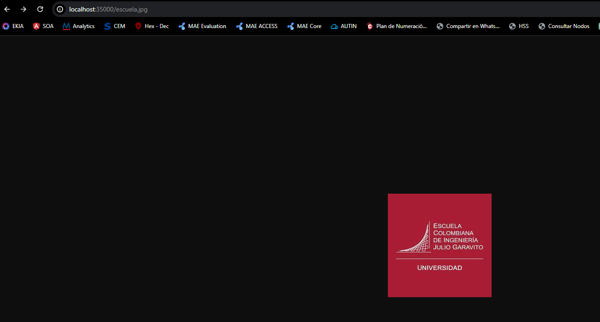
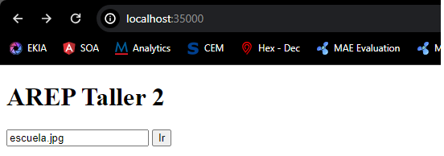

## Servidor Web Java Simple
Este repositorio contiene un servidor web simple implementado en Java que admite múltiples solicitudes seguidas (no concurrentes). El servidor es capaz de leer archivos del disco local y devolver todos los archivos solicitados, incluyendo páginas HTML, archivos JavaScript, CSS e imágenes. Además, se proporciona una aplicación web de prueba construida con JavaScript, CSS e imágenes para probar el servidor. La aplicación web incluye comunicación asíncrona con servicios REST en el backend.

## Uso del Código
El archivo Taller2.java contiene la implementación del servidor web. A continuación, se muestran las principales características y funcionalidades del servidor:

El servidor escucha en el puerto 35000.
Puede manejar múltiples solicitudes seguidas de manera no concurrente.
Lee las solicitudes HTTP entrantes y determina si corresponden a archivos estáticos como HTML, CSS, JavaScript o imágenes.
Si la solicitud corresponde a un archivo estático, lo lee del disco local y lo devuelve como respuesta HTTP.
Si la solicitud no corresponde a ningún archivo estático conocido, devuelve una página de índice HTML predeterminada.
## Ejecución del Servidor
1. Primero clone el github en la carpeta de su preferencia
####Github
`git clone https://github.com/YhonatanGoomez/AREP_2.git`
2. Abrir el Proyecto con tu IDLE de preferencia y ejecutar los siguientes comandos:
   
        mvn package
		mvn exec:java
		o
		mvn exec:java -"Dexec.mainClass"="arep2.taller2.Taller2
    
3. El servidor comenzará a escuchar en el puerto 35000. Puede acceder al servidor a través de un navegador web utilizando la dirección http://localhost:35000.
4. Ya podremos realizar busqueda de los archivos

## Estructura del Proyecto
Taller2.java: Implementación del servidor web Java.
src/main/resources/public/: Directorio que contiene archivos estáticos como HTML, CSS, JavaScript e imágenes para ser servidos por el servidor.
index.html: Página principal de la aplicación web de prueba.
styles.css: Hoja de estilos CSS para la aplicación web.
script.js: Archivo JavaScript para la lógica de la aplicación web.
## Notas Adicionales
Este servidor web fue implementado sin el uso de frameworks web como Spark o Spring. Se utilizaron solo las librerías estándar de Java para el manejo de la red.
